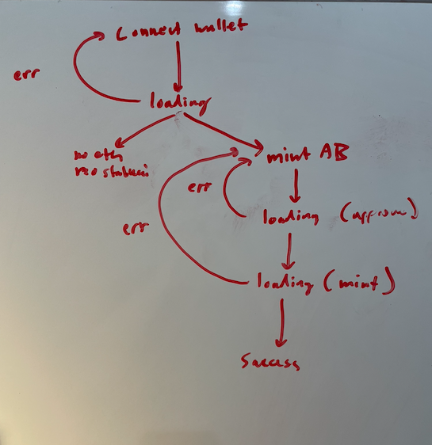

# AlgoBull Web App

A web front-end for supporting interactions with the [AlgoBull contract](https://github.com/ANDREWBTC707/-ALGOBULL).

## Project Plan
- [x] Connect Wallet UX
  - [x] Failure Dialogue
    - [x] Network is not supported
  - [x] Button
- [x] Form UX
  - [x] Failure Dialogue 
  - [x] Mint button
  - [x] Quantity field
  - [x] Token balance
- [x] Loading UX with spinner
- [x] Minted UX with a quantity received and scan link.
- [x] Design should be branded consistently with https://www.algobull.art/
- [x] Should implement state machine

  

## To Run it
```
elm-app start
```

